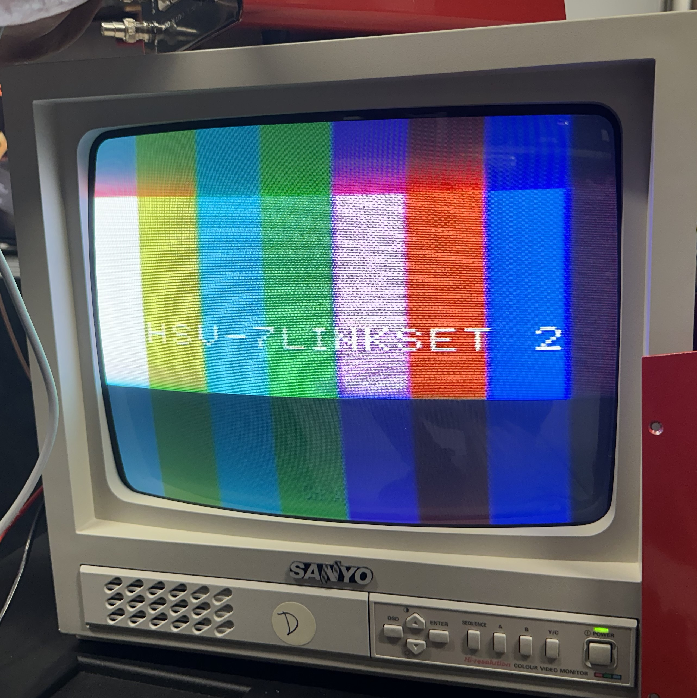

# PT430
PRACTEL PT-430 Color bar Generator EPROM Code generator.
The PRACTEL PT-430, developed in the early 1990s for the Australian broadcast industry, was primarily used in Electronic News Gathering (ENG) to transmit station IDs over microwave links.\
This repository aims to recreate the 27C64 EPROM code that generates the PT-430’s color black, color bars and pulse-and-bar test patterns, including a center-aligned station ID. Through reverse engineering,\
I've determined that the EPROM utilizes two horizontal counters to sequentially output a 7-bit and a second 4-bit binary counter to sequence the correct GRBW data.\
What's inside the EPROM is a mystery 🕵️ which has lead to reverse Engineering the HEX code inside the 27C64 to find out how and can we implement both the pattern sequence as well as the text identification.

This project serves as a functional program to effectively generate the HEX code in the 27C64 EPROM or (28C64 EEPROM) to personalise the test patterns and identification text on the PT-430, enabling\
continued use of the PT430 for amateur television (ATV) applications.

## 27C64 8K EPROM addressing as I see it.
### Address Map Overview
A0–A6: (7 bits) Selects the first 140 lines of the pattern, a cascaded 4bit binary ripple counter 74HC393(IC7) clocked at 5Mhz to form the pixel clock.

A7–A10: (4 bits) Selects 14 lines dedicated to the white ID overlay text counter CD4520 (IC5:B) binary up counter.

A11–A12: (2 bits) Pattern selector via the front panel pattern selection toggle switch.

7 bits translates to a 2K pattern block:

| Address Range   | A12 | A11 | Description           | Pattern                       |
|-----------------|-----|-----|-----------------------|-------------------------------|
| 0x0000–0x07FF   | 0   | 0   | Pattern 0 (2K)        | Active pattern (color black)  |
| 0x0800–0x0FFF   | 0   | 1   | Pattern 1 (2K)        | Active pattern (color bars)   |
| 0x1000–0x17FF   | 1   | 0   | Pattern 2 (2K)        | Active pattern (pulse & bar)  |
| 0x1800–0x1FFF   | 1   | 1   | Pattern 3 (2K)        | Reserved for expansion        |

### Data Line Assignments
D0: Green channel
D1: Red channel
D2: Blue channel
D3: White channel added to blue and red channel for balancing 100% white bar

The White channel (D3) should be active when both Red (D1) and Blue (D2) channels are active.\
This can be represented by the logical AND operation:  D3 = D1 AND D2

|         | G  | R  |  B |  W             |   4bit    |
|---------|----|----|----|----------------|-----------|
| Colour  | D0 | D1 | D2 | D3= D1 AND D2  | HEX CODE  |
| BLACK   | 0  | 0  | 0  |  0             |    0x00   |
| RED     | 0  | 1  | 0  |  1             |    0x05   |
| BLUE    | 0  | 0  | 1  |  1             |    0x03   |
| MAGENTA | 0  | 1  | 1  |  1             |    0x07   |
| GREEN   | 1  | 0  | 0  |  0             |    0x01   |
| YELLOW  | 1  | 1  | 0  |  1             |    0x0D   |
| CYAN    | 1  | 0  | 1  |  1             |    0x0B   |
| WHITE   | 1  | 1  | 1  |  1             |    0x0F   |

Each of color output is 74HC273 (IC8) latched which is clocked at 2.5Mhz to provide a stable digital RGBW signal to drive the luminance matrix in addition to the U & V color modulators.

### Pattern Selection Toggle Switch
The toggle switch connected to A11 and A12 allows selection between the two active pattern blocks:

Position 1: A11=0, A12=1 → Selects Pattern 1 (0x0800–0x0FFF)

Position C: A11=0, A12=0 → Selects Pattern 0 (0x0000–0x07FF)

Position 2: A11=1, A12=0 → Selects Pattern 2 (0x1000–0x17FF)

Each pattern is a block of 2K switchable via address lines A11 and A12.
Technically the EPROM can address 4 patterns.

## Pictures
Here's a working image of the output with pattern 1 selected.\
PAL-BG 4:3  128 pixels across by 154 with odd and even field interlacing.

